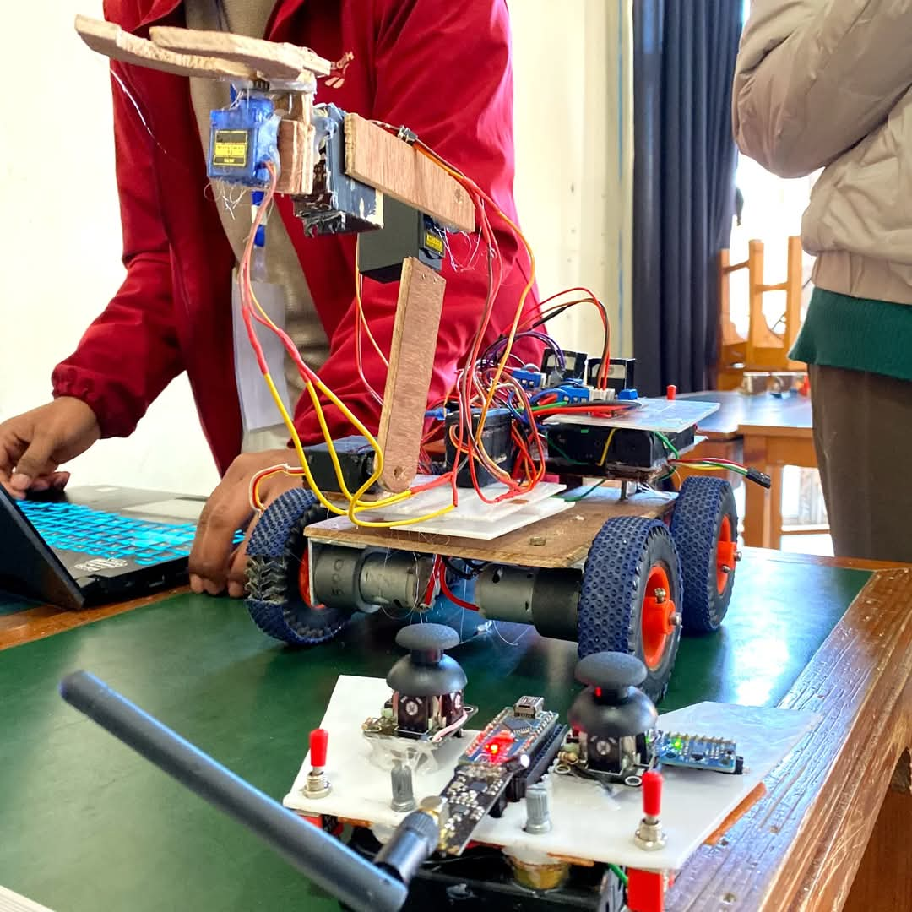
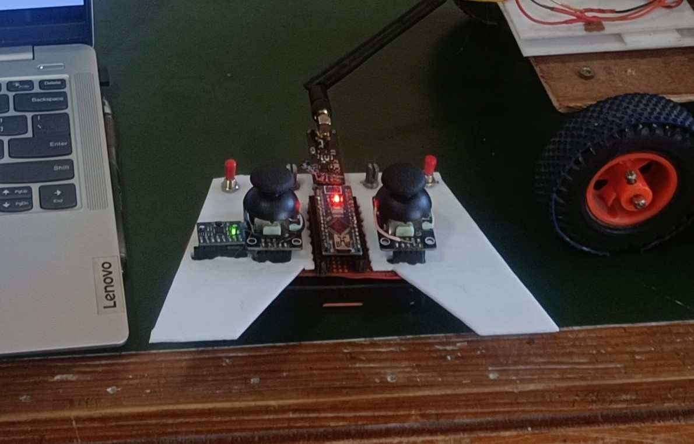
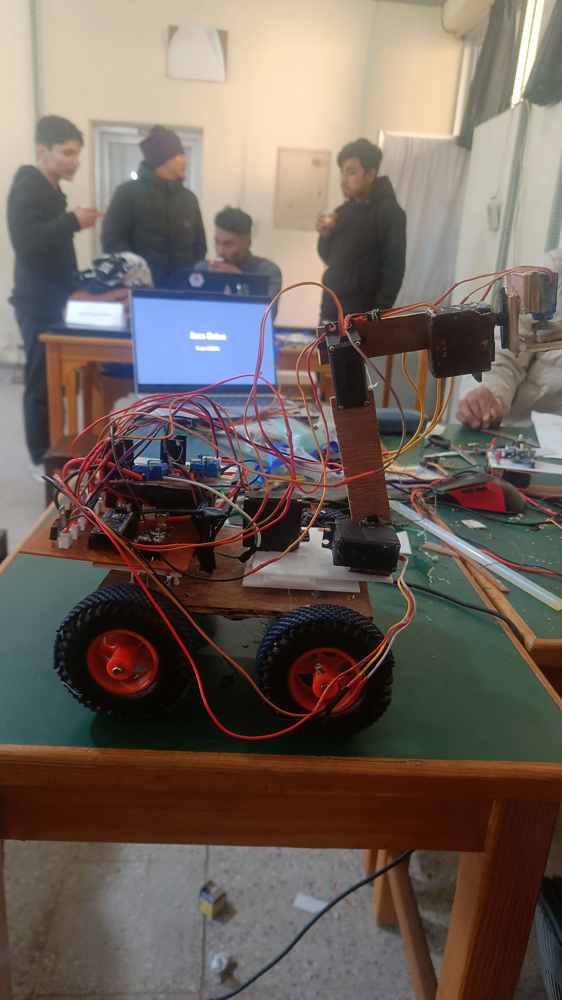
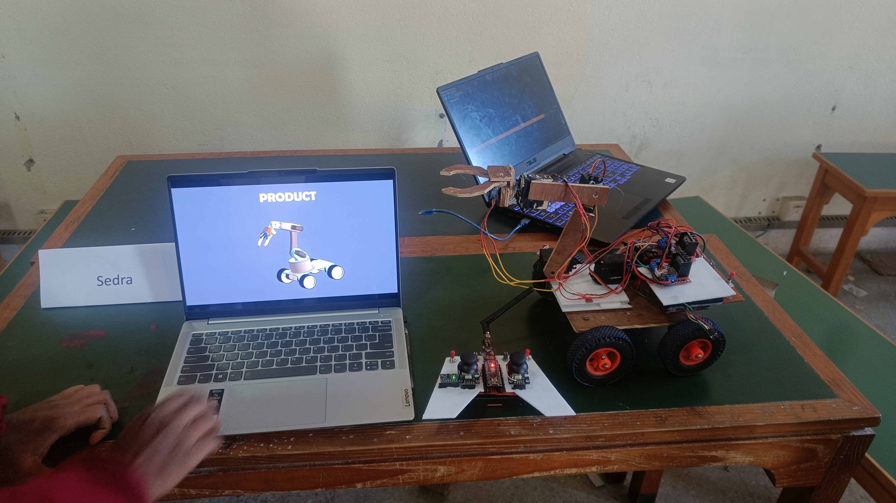

# 🤖 ARM Drive

**ARM Drive** is a four-wheel robot equipped with a 5-DOF robotic arm with inverse kinematics. It is wirelessly controlled by a custom-built 2.4Ghz radio gamepad featuring joysticks and gesture controls powered by the MPU6050 IMU.

> ⚡ Built in under 24 hours from scratch during the **24-Hour KU Hackathon**!

---

*Sketchy but functional – built from scratch overnight.*

---

## 🚀 Features

- **5-DOF Robotic Arm** with inverse kinematics for precise movement
- **4-Wheel Drive Base** for mobility
- **Custom Wireless Controller** with:
  - Dual Joysticks for drive + arm control
  - **MPU6050 IMU** for intuitive gesture-based control
- **Wireless Communication** between controller and robot using NRF24LO1 radio modules

---

## 🛠️ Tech Stack / Components

- **Microcontrollers**: Arduino nano
- **Motor Driver**: L298N
- **IMU**: MPU6050 (Accelerometer + Gyro)
- **Communication**: NRF24L01 2.4GHz modules
- **Inverse Kinematics**: Custom IK logic for 5DOF arm
- **Chassis**: Scratch-built wood, and arcylic sheet for controller

---

## 🕹️ Controller

- Dual-axis joysticks for movement & arm control  
- Tilt-based gestures via IMU for intuitive arm positioning  

---

## 🔧 How It Works

1. **Gamepad** reads joystick + IMU input
2. Sends data wirelessly via NRF24L01
3. **Robot** receives commands, calculates arm end point (using inverse kinematics), and drives motors accordingly

---

## 📷 More Images

| Robot Arm Close-up | Underside Wiring |
|--------------------|------------------|
|  |  |

---

## 🤝 Acknowledgements

Special thanks to the organizing team of **24 Hour KU Hackathon** for the platform and opportunity.

---

> "Ignore the sketchy build."
